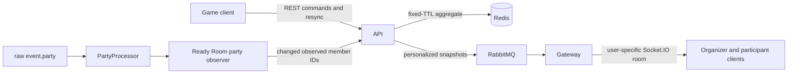

# Party Finder Ready Room Design

## Summary

Party Finder currently creates a 30-minute gathering, sends it to selected Lootlog guilds, and forwards volunteer payloads only to the organizer's connected sockets. The organizer's game client stores the participant list in `sessionStorage`. Invite state is a local five-second timeout, and a refresh or reconnect cannot recover the authoritative participant state.

This design makes the API the owner of an ephemeral Ready Room stored in Redis. The gateway distributes personalized snapshots to the organizer and participants. The game client becomes a projection of that state, while the existing raw `event.party` pipeline reports observed party membership.

The Ready Room remains an information and coordination feature. It never moves a character, starts combat, chooses a target, accepts an invitation, or reacts to a game event by executing an action. Explicit party and friend invitations initiated by a user's click remain allowed, including `Invite all`.

## Goals

- Provide a recoverable Ready Room for organizers and applicants.
- Support organizer acceptance, participant ready checks, invitation status, and automatic observation of party membership.
- Allow several pending applications per user but at most one accepted Ready Room at a time.
- Keep the session live-only, with a fixed 30-minute lifetime and no durable history.
- Preserve explicit single and batch party invitations initiated from the UI.
- Make reconnects and out-of-order realtime delivery safe.
- Keep authorization and state transitions on the API side.

## Non-goals

- Automatic matchmaking, acceptance, invitation, retry, party joining, movement, targeting, combat, or build changes.
- Persistent gathering history or analytics.
- Scheduled gatherings, profession slots, applicant freshness, AFK handling, or the active-gathering feed. Those are separate recommended verticals.
- Detecting whether Margonem displayed or rejected an invitation when no corresponding event is available.
- Reworking unrelated notification, chat, or presence architecture.

## Product Rules

### Allowed game actions

The following actions are allowed because the user explicitly initiates them:

- inviting one accepted applicant to the party;
- inviting all eligible accepted applicants to the party;
- inviting a character to friends through its dedicated button.

These actions may only start from their corresponding click handlers. A socket message, ready response, state transition, timer, reconnect, render, effect, or raw game event must never invoke them. Batch invitation may continue sequentially after the initiating click, but it uses the eligible target snapshot captured for that command and never retries automatically.

### Invitation meaning

`SENT` means that Lootlog issued the invitation command. It does not mean that Margonem delivered the invitation or that the player accepted it. A missing response never changes the state to `FAILED`. Retrying requires another explicit user click. `FAILED` is a manual organizer annotation until a reliable read-only failure signal exists.

### Multiple applications

A user may be `APPLIED` to multiple gatherings. The user may be `ACCEPTED` in only one active Ready Room. Accepting the user elsewhere returns a conflict and does not withdraw their other applications.

## Architecture

### API

The API is the sole authority for Ready Room state and transitions. Controllers validate DTO shape and authentication. A focused Ready Room service enforces domain rules and authorization. A Redis-backed repository handles atomic revision checks and fixed TTL preservation. Existing gathering creation, chat delivery, and cancellation remain entry points into the lifecycle.

### Redis

The Ready Room aggregate is stored by gathering notification ID. Secondary keys locate:

- the organizer's active gathering;
- the accepted Ready Room for a participant;
- the pending application gathering IDs for a participant.

The repository owns these keys so service code cannot update indexes independently from the aggregate. Mutations use an atomic compare-and-set Lua script over the serialized aggregate. A successful write increments `revision` while preserving the original `expiresAt`; normal activity never extends the 30-minute lifetime.

Terminal `CLOSED` or `CANCELLED` snapshots remain as short-lived tombstones long enough to propagate and are then deleted. Expiration leaves no history.

### RabbitMQ and gateway

After a successful mutation, the API publishes recipient-specific envelopes containing a complete projection and its revision. The gateway joins every authenticated socket to a server-controlled `user:{discordId}` room and emits envelopes only to that room.

The organizer projection contains the full participant list. A participant projection contains the gathering summary and only that participant's state. This avoids broadcasting applicant details across the guild or exposing organizer-only controls.

Realtime delivery is an optimization, not the source of truth. If publish or delivery fails, the mutation remains committed and clients recover through REST resynchronization.

### Game client

The client store holds the latest Ready Room projection. It replaces state only when an incoming snapshot has a newer revision. The organizer and participant views are separate components and share small presentational status components without placing multiple React components in one file.

The current `inviteStates` timeout state is removed. Explicit invitation commands remain in click handlers and are followed by an API mutation marking the issued command as `SENT`. A command error leaves the prior invitation state unchanged and is surfaced to the organizer.

Generated API clients continue to be generated from the OpenAPI contract and are never edited manually.

## Domain Model

### Ready Room session

An active session contains:

- `notificationId`;
- organizer Discord ID and character snapshot;
- selected guild IDs and world;
- optional description and level range;
- `status`: `ACTIVE`, `CLOSED`, or `CANCELLED`;
- `revision`;
- `createdAt`, `expiresAt`, and `updatedAt`;
- optional current ready-check round;
- participants keyed by stable participant identity.

The stable participant identity includes the authenticated Discord ID and the submitted character ID. Character display fields remain a snapshot for the lifetime of the gathering.

### Participant state

Participant state is split into independent dimensions:

- `application`: `APPLIED`, `ACCEPTED`, `DECLINED`, `WITHDRAWN`;
- `readiness`: `NOT_REQUESTED`, `PENDING`, `READY`, `NOT_READY`;
- `invitation`: `NOT_MARKED`, `SENT`, `FAILED`;
- `partyPresence`: `OUTSIDE`, `IN_PARTY`.

The UI derives a primary stage from these fields and may show additional badges. The model does not collapse unrelated facts into one lossy enum.

### Ready-check round

Starting a ready check creates a new monotonically increasing round ID and resets readiness for all currently accepted participants to `PENDING`. Responses name the expected round. A response for an older round is rejected and never carries into the next check.

## Authorization and Transitions

### Organizer commands

The organizer may:

- accept or decline an `APPLIED` participant;
- start a ready-check round;
- mark an accepted participant invitation `SENT` or `FAILED`;
- report the currently observed party member character IDs;
- close or cancel the gathering;
- explicitly invite one or all eligible participants through the game client UI.

The organizer may not answer readiness for another participant.

### Participant commands

The authenticated participant may:

- apply with the current character snapshot;
- withdraw their own application;
- respond `READY` or `NOT_READY` for the active round after acceptance.

The participant may not mutate another participant or organizer-only fields.

### System-derived transitions

Only an authenticated organizer client may report observed party membership for its active gathering. The API intersects the submitted character IDs with accepted participants. It updates `partyPresence` idempotently and does not infer acceptance, readiness, invitation delivery, or failure.

Reporting game state is read-only coordination. It never calls a Margonem action API.

## API Surface

Exact DTO names may follow repository conventions, but the contract must provide these capabilities:

- create a gathering and its Ready Room;
- fetch the organizer's active Ready Room;
- fetch the authenticated user's pending and accepted Ready Room projections;
- apply to a gathering;
- withdraw the authenticated user's application;
- accept or decline an applicant as organizer;
- start a ready-check round;
- respond to the current ready-check round as participant;
- mark invitation state as organizer;
- report observed party member character IDs as organizer;
- close or cancel the gathering.

Every mutation includes `expectedRevision`. Successful responses return the new personalized snapshot. A stale mutation returns the latest authorized projection so the client can replace local state.

## User Interface

### Organizer view

The Party Finder window shows:

- gathering purpose, world, and current party count;
- new applications with `Accept` and `Decline` actions;
- accepted participants with readiness, invitation, and party-presence badges;
- `Start ready check`;
- explicit `Invite` and `Invite all` actions;
- manual invitation-status actions where needed;
- close and cancel controls.

`Invite all` targets accepted participants who are not currently `IN_PARTY`. It issues at most one command per eligible character for that click. It does not select applicants, accept them, retry them, or run because state changed.

### Participant view

After applying, the gathering card exposes `Open Ready Room`. The participant view shows:

- the gathering summary and requirements;
- only the current user's application, readiness, invitation, and party-presence state;
- `Ready` and `Not yet` for an active ready check;
- `Withdraw` while the application can still be withdrawn.

The participant never receives organizer-only controls or the private applicant list.

### Text and component rules

All user-facing strings use the existing i18n namespaces. Labels distinguish commands from observations. In particular, `SENT` copy must not imply acceptance. React files follow the repository's one-component-per-file rule and rely on React Compiler rather than manual memoization.

## Reconnect and Error Handling

- `403 Forbidden`: the authenticated user cannot view or mutate the session.
- `404 Not Found`: the session expired or no longer exists; the client clears the projection and closes stale controls.
- `409 Conflict`: revision conflict or participant accepted elsewhere. The response includes an error code and the latest authorized projection when available.
- `422 Unprocessable Entity`: the requested transition is invalid for the current state.
- Disconnected socket: the last snapshot remains visible as stale, and state-changing controls are disabled until resynchronization.
- Socket reconnect or window reopen: fetch full authorized projections from the API before applying later socket snapshots.
- Out-of-order or duplicate socket envelope: ignore a revision that is not newer than the stored revision.
- RabbitMQ publish failure: log the failure and retain the committed Redis state. REST resync remains authoritative.
- Explicit game-command failure: do not mark `SENT`; show an actionable organizer error.
- Missing game acknowledgement: do not synthesize `FAILED`.

## Testing Strategy

### API and repository

- Atomic compare-and-set succeeds only for the expected serialized revision.
- Every successful mutation increments revision and preserves `expiresAt`.
- Terminal tombstones expire and leave no Ready Room history.
- Authorization is tested for every organizer and participant command.
- State-transition tests cover application, acceptance, ready-check rounds, invitation annotations, withdrawal, close, and cancel.
- A user may have several `APPLIED` states but only one `ACCEPTED` room.
- Concurrent acceptance by two rooms has one winner and one `ACCEPTED_ELSEWHERE` conflict.
- Observed party reports only affect accepted matching character IDs.

### Gateway

- Authenticated sockets join only their own server-controlled user room.
- Organizer and participant envelopes route only to their intended user rooms.
- Queue handlers preserve revision and projection payloads.
- A guild-wide room never receives Ready Room participant data.

### Game client

- The store ignores duplicate and older revisions.
- Reconnect and window-open flows replace stale local state with the REST snapshot.
- Organizer and participant views expose only authorized actions.
- Starting a later ready-check round clears earlier answers.
- `PartyProcessor` observation reports only a changed party-member set and never invokes a game action.
- Single invite calls the party invite helper only after its button click.
- `Invite all` calls the helper once per eligible participant only after its button click.
- Socket events, mount effects, timers, ready transitions, reconnects, and raw party events never invoke invitation or friend helpers.
- A missing invitation acknowledgement does not create `FAILED`.
- Existing gathering creation, cancellation, chat card, and notification behavior remain covered by regression tests.

### Verification commands

Run the narrow unit and integration suites for changed API, gateway, and game-client modules, followed by their package typechecks and lint tasks. Do not start the application; repository instructions say to assume it is already running.

## Success Criteria

The MVP is complete when evidence proves that:

1. An organizer creates a gathering and several users can apply.
2. The organizer can accept applicants while the API enforces one accepted room per user.
3. An accepted participant can answer a versioned ready check.
4. The organizer can explicitly invite one or all eligible participants and see truthful invitation-command state.
5. Raw `event.party` changes matching accepted participants to `IN_PARTY` without executing a game action.
6. Organizer and participant state recovers after refresh or reconnect.
7. Unauthorized and stale commands cannot overwrite current state.
8. Expiration removes the session without durable history.
9. Tests prove that no game action is initiated without the corresponding explicit user command.

## Implementation Record

At the end of implementation, create `docs/superpowers/implementation/2026-07-13-party-finder-ready-room-implementation.md`. Record only verified facts:

- implemented behavior and affected modules;
- database or realtime contracts added or changed;
- tests and verification commands with results;
- explicit game-action boundary and its tests;
- intentionally deferred items from the research plan;
- any known limitations or follow-up work.

This record is not a substitute for tests and must not claim work that current repository evidence does not prove.
