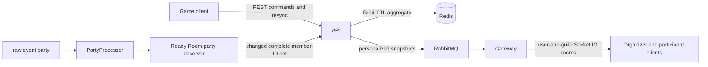

# Party Finder Ready Room Design

## Summary

Party Finder currently creates a 30-minute gathering, sends it to selected Lootlog guilds, and forwards volunteer payloads only to the organizer's connected sockets. The organizer's game client stores the participant list in `sessionStorage`. Invite state is a local five-second timeout, and a refresh or reconnect cannot recover the authoritative participant state.

This design makes the API the owner of an ephemeral Ready Room stored in Redis. The gateway distributes personalized snapshots to the organizer and participants. The game client becomes a projection of that state, while the existing raw `event.party` pipeline reports a complete observed party-membership snapshot.

The Ready Room remains an information and coordination feature. It never moves a character, starts combat, chooses a target, accepts an invitation, or reacts to a game event by executing an action. Explicit party and friend invitations initiated by a user's click remain allowed, including `Invite all`.

## Goals

- Provide a recoverable Ready Room for organizers and applicants.
- Support organizer acceptance, participant ready checks, invitation status, and automatic observation of party membership.
- Allow several pending applications per user but at most one accepted Ready Room at a time.
- Keep the session live-only, with a fixed 30-minute lifetime and no durable history.
- Preserve explicit single and batch party invitations initiated from the UI.
- Make reconnects and out-of-order realtime delivery safe.
- Keep authorization and state transitions on the API side.

## Non-goals

- Automatic matchmaking, acceptance, invitation, retry, party joining, movement, targeting, combat, or build changes.
- Persistent gathering history or analytics.
- Scheduled gatherings, profession slots, applicant freshness, AFK handling, or the active-gathering feed. Those are separate recommended verticals.
- Detecting whether Margonem displayed or rejected an invitation when no corresponding event is available.
- Reworking unrelated notification, chat, or presence architecture.

## Product Rules

### Allowed game actions

The following actions are allowed because the user explicitly initiates them:

- inviting one accepted applicant to the party;
- inviting all eligible accepted applicants to the party;
- inviting a character to friends through its dedicated button.

These actions may only start from their corresponding click handlers. A socket message, ready response, state transition, timer, reconnect, render, effect, or raw game event must never invoke them. Batch invitation may continue sequentially after the initiating click, but it uses the eligible target snapshot captured for that command and never retries automatically.

### Invitation meaning

`SENT` means either that Lootlog issued the invitation command or that the organizer explicitly annotated an invitation sent outside Lootlog. The invitation record carries `source: LOOTLOG_COMMAND | MANUAL_ANNOTATION`, so the UI can state which one occurred. `SENT` does not mean that Margonem delivered the invitation or that the player accepted it.

An invitation initiated through Lootlog uses a two-phase protocol:

1. The client reserves a unique command ID through the API before calling the game helper.
2. Only a successful reservation allows that click flow to call the helper once for the reserved target.
3. The client acknowledges that the command was issued. The API then records `SENT` with `source: LOOTLOG_COMMAND`.
4. If acknowledgement is lost, the persisted reservation remains `COMMAND_RESERVED`; after its deadline the client derives the display status `UNKNOWN`. Neither the client nor server retries the game action automatically.
5. The organizer must explicitly reconcile `UNKNOWN` or click retry, which creates a new command ID.

A synchronous helper invocation error is reported to the API and becomes `FAILED` with `source: LOOTLOG_COMMAND`. Acknowledgements are idempotent by per-target command ID and may retry their HTTP request without invoking the game helper again. An acknowledgement applies only while its command ID is the participant's current reservation; a stale command ID returns a conflict. A missing Margonem response is neither success nor failure and never synthesizes `FAILED`.

### Multiple applications

A user may be `APPLIED` to multiple gatherings. The user may be `ACCEPTED` in only one active Ready Room. Accepting the user elsewhere returns a conflict and does not withdraw their other applications.

## Architecture

### API

The API is the sole authority for Ready Room state and transitions. Controllers validate DTO shape and authentication. A focused Ready Room service enforces domain rules and authorization. A Redis-backed repository handles atomic revision checks and fixed TTL preservation. Existing gathering creation, chat delivery, and cancellation remain entry points into the lifecycle.

### Redis

The Ready Room aggregate is stored by gathering notification ID. Secondary keys locate:

- the organizer's active gathering;
- the accepted Ready Room for a participant;
- the pending application gathering IDs for a participant.

The organizer and accepted-room indexes are string keys with the same fixed expiration as the aggregate. Pending applications use a sorted set per user, with `expiresAt` as the score. Reads remove expired or missing members before returning results. The sorted-set key expires at the latest contained score.

The repository owns all aggregate and index keys so service code cannot update them independently. Command-specific Lua scripts update the aggregate, participant application index, and accepted-room lock atomically. Acceptance uses the accepted-room key as the single arbiter and produces one winner across concurrent rooms. Withdrawal, decline, close, and cancel delete that lock only when its value matches the current room. Natural expiration cannot leave an active lock because the lock and aggregate share `expiresAt`.

Mutations use atomic compare-and-set over the serialized aggregate. A successful write increments `revision` while preserving the original `expiresAt`; normal activity never extends the 30-minute lifetime.

Explicit `CLOSED` or `CANCELLED` transitions remove all secondary indexes atomically and retain a short-lived aggregate tombstone long enough to propagate. Natural expiration produces no realtime tombstone; later reads return `404` and lazily prune pending indexes. Neither path leaves history.

### RabbitMQ and gateway

After a successful mutation, the API publishes recipient-specific envelopes containing a complete projection and its revision. The gateway joins every authenticated socket to server-controlled `user:{discordId}:guild:{guildId}` rooms for its current Lootlog guild memberships. A personalized envelope names the selected guild IDs through which the recipient remains eligible. The gateway emits to those user-and-guild rooms, and the client deduplicates copies by notification ID and revision. Existing permission rebalancing removes sockets from rooms after guild access is lost.

The organizer projection contains the full participant list. A participant projection contains the gathering summary and only that participant's state. This avoids broadcasting applicant details across the guild or exposing organizer-only controls.

Realtime delivery is an optimization, not the source of truth. If publish or delivery fails, the mutation remains committed and clients recover through REST resynchronization.

### Game client

The client store holds projections keyed by `notificationId`, plus derived pending-room IDs and the accepted-room ID. REST responses and socket envelopes merge per room only when their revision is newer than the stored revision. A delayed REST response therefore cannot replace a newer socket snapshot. Terminal tombstones remove the room from derived indexes after their final projection is shown.

The current five-second `inviteStates` failure timeout is removed. Explicit invitation click handlers first reserve a server command ID, then invoke the game helper once, then acknowledge the issued command. A reservation conflict prevents the game helper call. After a lost acknowledgement, a client timer derives `UNKNOWN` from `reservationExpiresAt` without replacing the stored room snapshot or requiring a new revision. It never triggers an automatic retry.

Generated API clients continue to be generated from the OpenAPI contract and are never edited manually.

## Domain Model

### Ready Room session

An active session contains:

- `notificationId`;
- organizer Discord ID and character snapshot;
- selected guild IDs and world;
- optional description and level range;
- `status`: `ACTIVE`, `CLOSED`, or `CANCELLED`;
- `revision`;
- `createdAt`, `expiresAt`, and `updatedAt`;
- optional current ready-check round;
- participants keyed by stable participant identity.

Each room has at most one participant record per authenticated Discord ID. The submitted character ID and display fields are attributes of that record, not part of its key. Reapplication from `DECLINED` or `WITHDRAWN` replaces the character snapshot. Repeating `APPLIED` with the same character is idempotent; using a different character while `APPLIED` returns `409 CHARACTER_ALREADY_APPLIED`. An `ACCEPTED` user must withdraw before applying with another character.

### Participant state

Participant state is split into independent dimensions:

- `application`: `APPLIED`, `ACCEPTED`, `DECLINED`, `WITHDRAWN`;
- `readiness`: `NOT_REQUESTED`, `PENDING`, `READY`, `NOT_READY`;
- `invitation`: `NOT_MARKED`, `COMMAND_RESERVED`, `SENT`, `FAILED`;
- `partyPresence`: `OUTSIDE`, `IN_PARTY`.

The UI derives a primary stage from these fields and may show additional badges. The model does not collapse unrelated facts into one lossy enum.

Invitation records also contain their per-target command ID when applicable, source, update timestamp, and reservation deadline. The UI derives `UNKNOWN` when `COMMAND_RESERVED` passes its deadline. Reconciliation or retry is an explicit organizer command and a stale acknowledgement cannot overwrite it.

### Ready-check round

Starting a ready check creates a new monotonically increasing round ID and resets readiness for all currently accepted participants to `PENDING`. Responses name the expected round. A response for an older round is rejected and never carries into the next check.

An applicant accepted while a round is active enters that round as `PENDING`. A participant who is declined or withdraws during a round is removed from the ready-count denominator; the round itself continues.

## Transition Rules

| Command           | Preconditions                                                   | Result                                                                | Accepted-room lock |
| ----------------- | --------------------------------------------------------------- | --------------------------------------------------------------------- | ------------------ |
| Apply or reapply  | Active room, eligible user, state absent/`DECLINED`/`WITHDRAWN` | `APPLIED`; reset readiness, invitation, and party presence            | Unchanged          |
| Accept            | Organizer, `APPLIED`, no other accepted-room lock               | `ACCEPTED`; readiness is `PENDING` if a round is active               | Acquire atomically |
| Decline           | Organizer, `APPLIED` or `ACCEPTED`                              | `DECLINED`; reset readiness, invitation, and party presence           | Release if held    |
| Withdraw          | Same participant, `APPLIED` or `ACCEPTED`                       | `WITHDRAWN`; reset readiness, invitation, and party presence          | Release if held    |
| Start ready check | Organizer, active room, at least one accepted participant       | New round; all accepted participants become `PENDING`                 | Unchanged          |
| Ready response    | Same accepted participant, current round                        | `READY` or `NOT_READY`                                                | Unchanged          |
| Close/cancel      | Organizer, active room                                          | Terminal tombstone                                                    | Release all        |
| Natural expiry    | `expiresAt` reached                                             | Aggregate and fixed-TTL locks disappear; pending indexes prune lazily | Expire             |

Withdrawing from the Ready Room never leaves an existing Margonem party. Reapplication after `DECLINED` or `WITHDRAWN` is allowed while the room remains active. `CLOSED` means the organizer completed recruitment; `CANCELLED` means the organizer abandoned it. Both are terminal, release the same indexes, use different user-facing copy, and cannot be reopened.

### Invitation command transitions

| Command                  | Preconditions                                                                                         | Persisted result                                                                 | Game action                                                       |
| ------------------------ | ----------------------------------------------------------------------------------------------------- | -------------------------------------------------------------------------------- | ----------------------------------------------------------------- |
| Reserve single           | Organizer revision is current; participant is `ACCEPTED`, `OUTSIDE`, and has no unexpired reservation | New per-target command ID and `COMMAND_RESERVED` with a 15-second deadline       | None                                                              |
| Reserve batch            | Organizer revision is current; at least one participant meets single-reserve rules                    | Batch ID plus an immutable list of independently reserved per-target command IDs | None                                                              |
| Acknowledge issued       | Per-target command ID matches the current reservation                                                 | `SENT`, `source: LOOTLOG_COMMAND`                                                | None; helper already ran once                                     |
| Acknowledge helper error | Per-target command ID matches the current reservation                                                 | `FAILED`, `source: LOOTLOG_COMMAND`                                              | None; records only a synchronous invocation error                 |
| Manual annotation        | Organizer revision is current; participant is `ACCEPTED`                                              | `SENT` or `FAILED`, `source: MANUAL_ANNOTATION`, without a command ID            | None                                                              |
| Reconcile unknown        | Reservation deadline passed and command ID still matches                                              | Organizer explicitly chooses `SENT`, `FAILED`, or clears to `NOT_MARKED`         | None                                                              |
| Explicit retry           | Reservation deadline passed or invitation is terminal; organizer revision is current                  | A new per-target command ID and reservation replace the old record               | The click flow invokes the helper once after reservation succeeds |

Every batch target is acknowledged independently by its per-target command ID. The batch ID is only a grouping identifier for UI progress. Acknowledgement requests may be retried because they never call the game helper.

## Authorization and Transitions

### Organizer commands

The organizer may:

- accept or decline an `APPLIED` participant;
- start a ready-check round;
- reserve and reconcile invitation commands or add a manual invitation annotation;
- report the complete currently observed party member character-ID set;
- close or cancel the gathering;
- explicitly invite one or all eligible participants through the game client UI.

The organizer may not answer readiness for another participant.

### Participant commands

The authenticated participant may:

- apply with the current character snapshot;
- withdraw their own application;
- respond `READY` or `NOT_READY` for the active round after acceptance.

The participant may not mutate another participant or organizer-only fields.

### System-derived transitions

Only an authenticated organizer client may report observed party membership for its active gathering. The payload is a complete snapshot, including an empty array when the organizer is not in a party. Initial game detection reports once after the Ready Room loads; later reports occur only when the normalized set changes. The API sets matching accepted participants to `IN_PARTY` and all other accepted participants to `OUTSIDE`.

The existing `PartyProcessor` continues treating raw `event.party.members` as the complete party snapshot and clearing the party store for an absent or empty membership set. The Ready Room observer reads that normalized store rather than parsing a second event shape.

Reporting game state is read-only coordination. It never calls a Margonem action API.

## API Surface

Exact DTO names may follow repository conventions, but the contract must provide these capabilities:

- create a gathering and its Ready Room;
- fetch the organizer's active Ready Room;
- fetch the authenticated user's pending and accepted Ready Room projections;
- apply to a gathering;
- withdraw the authenticated user's application;
- accept or decline an applicant as organizer;
- start a ready-check round;
- respond to the current ready-check round as participant;
- reserve a single or batch invitation command as organizer;
- acknowledge issued or failed reserved commands by per-target command ID;
- manually reconcile or annotate invitation state as organizer;
- report a complete observed party member character-ID snapshot as organizer;
- close or cancel the gathering.

Creation has no prior revision. Apply/reapply is identity-idempotent and uses a bounded server-side CAS retry because the applicant may not yet possess a room projection. Participant-local withdrawal and ready responses use the authenticated participant ID plus semantic preconditions such as `roundId`; they use bounded server-side CAS retries instead of the global aggregate revision. One participant's response therefore cannot make another participant's response stale. Background party observation is also idempotent and uses a bounded server-side CAS retry; exhaustion returns the latest projection and waits for the next changed snapshot or resync. Invitation acknowledgement is idempotent by per-target command ID and uses a bounded server-side CAS retry because the game command has already occurred.

Organizer commands, including acceptance, ready-check start, invitation reservation, manual reconciliation, close, and cancel, include `expectedRevision`. The organizer receives every successful room mutation, and a stale organizer mutation returns the latest organizer projection for replacement. Participant-local responses return that participant's projection at the aggregate revision produced by the mutation. REST and socket merges still compare aggregate revisions per room; no participant command requires a participant to have received unrelated intermediate revisions.

### Eligibility

Possession of a notification ID never grants access. Creation is the explicit pre-membership exception: an authenticated creator may create a room after the existing selected-guild and send-permission checks pass. First application is the explicit participant-membership exception: an authenticated non-participant may apply only after the existing common-selected-guild authorization passes and the API validates that the submitted world matches the room and the character level is within the configured range. The target organizer comes from the aggregate, not the applicant payload.

After creation or first application, every fetch and mutation requires the authenticated user to be the organizer or named participant and to retain membership in at least one selected guild. Gateway delivery uses the same selected-guild intersection through user-and-guild rooms. Lost guild access therefore removes realtime delivery and causes later API requests to return `403`.

## Command and Recipient Matrix

| Event                    | Revision policy                    | Personalized recipients                                   | Index effect                                            |
| ------------------------ | ---------------------------------- | --------------------------------------------------------- | ------------------------------------------------------- |
| Create                   | None                               | Organizer                                                 | Add organizer key                                       |
| Apply/reapply            | Server CAS retry                   | Organizer, applicant                                      | Add pending application                                 |
| Accept/decline           | Organizer expected revision        | Organizer, affected applicant                             | Remove pending; acquire on accept or release on decline |
| Withdraw                 | Participant semantic CAS retry     | Organizer, withdrawing participant                        | Release accepted lock and remove pending                |
| Start ready check        | Organizer expected revision        | Organizer, all accepted participants                      | None                                                    |
| Ready response           | Participant and round-ID CAS retry | Organizer, responder                                      | None                                                    |
| Reserve/reconcile invite | Organizer expected revision        | Organizer, affected participant(s)                        | None                                                    |
| Acknowledge invite       | Per-target command-ID CAS retry    | Organizer, affected participant(s)                        | None                                                    |
| Party snapshot           | Server CAS retry                   | Organizer, participants whose presence changed            | None                                                    |
| Close/cancel             | Organizer expected revision        | Organizer and participants currently `APPLIED`/`ACCEPTED` | Remove every secondary index before tombstone           |

Declined and withdrawn participants receive their final personalized projection before they are removed from active indexes. They receive later updates only after reapplying. Natural expiration has no publish event; all clients converge on the next REST resync.

## User Interface

### Organizer view

The Party Finder window shows:

- gathering purpose, world, and current party count;
- new applications with `Accept` and `Decline` actions;
- accepted participants with readiness, invitation, and party-presence badges;
- `Start ready check`;
- explicit `Invite` and `Invite all` actions;
- manual invitation-status actions where needed;
- close and cancel controls.

`Invite all` first reserves one batch command containing accepted participants who are not currently `IN_PARTY` and have no active reservation. Only a successful reservation returns the immutable eligible target list for that click. The client issues at most one game command per returned character and acknowledges issued targets. It does not select applicants, accept them, retry them, or run because state changed.

### Participant view

After applying, the gathering card exposes `Open Ready Room`. The participant view shows:

- the gathering summary and requirements;
- only the current user's application, readiness, invitation, and party-presence state;
- `Ready` and `Not yet` for an active ready check;
- `Withdraw` while the application can still be withdrawn.

The participant never receives organizer-only controls or the private applicant list.

### Text and component rules

All user-facing strings use the existing i18n namespaces. Labels distinguish commands from observations. In particular, `SENT` copy must not imply acceptance. React files follow the repository's one-component-per-file rule and rely on React Compiler rather than manual memoization.

## Reconnect and Error Handling

- `403 Forbidden`: the authenticated user cannot view or mutate the session.
- `404 Not Found`: the session expired or no longer exists; the client clears the projection and closes stale controls.
- `409 Conflict`: revision conflict or participant accepted elsewhere. The response includes an error code and the latest authorized projection when available.
- `422 Unprocessable Entity`: the requested transition is invalid for the current state.
- Disconnected socket: the last snapshot remains visible as stale, and state-changing controls are disabled until resynchronization.
- Socket reconnect or window reopen: fetch full authorized projections from the API before applying later socket snapshots.
- Out-of-order or duplicate socket envelope: ignore a revision that is not newer than the stored revision.
- RabbitMQ publish failure: log the failure and retain the committed Redis state. REST resync remains authoritative.
- Invitation reservation conflict: do not execute a game helper; merge the returned current projection.
- Lost invitation acknowledgement: show `UNKNOWN`; never retry the game helper automatically.
- Explicit game-helper failure: acknowledge `FAILED` for that command ID and show an actionable organizer error.
- Missing game acknowledgement: do not synthesize `FAILED`.

## Testing Strategy

### API and repository

- Atomic compare-and-set succeeds only for the expected serialized revision.
- Every successful mutation increments revision and preserves `expiresAt`.
- Terminal tombstones expire and leave no Ready Room history.
- Authorization is tested for every organizer and participant command.
- State-transition tests cover application, acceptance, ready-check rounds, invitation annotations, withdrawal, close, and cancel.
- Reapplication after decline or withdrawal resets all participant dimensions.
- One room stores one record per Discord ID; a character change follows the documented idempotency or conflict rules.
- An applicant accepted during a ready check enters the current round as `PENDING`.
- Decline or withdrawal during a round releases the accepted lock and removes the participant from the round count without changing Margonem party membership.
- A user may have several `APPLIED` states but only one `ACCEPTED` room.
- Concurrent acceptance by two rooms has one winner and one `ACCEPTED_ELSEWHERE` conflict.
- Observed party reports only affect accepted matching character IDs.
- Apply/reapply and background observation CAS retries are bounded and idempotent.
- Concurrent participant ready responses merge without avoidable global-revision conflicts.
- Explicit terminal transitions atomically release organizer, accepted-room, and pending-application indexes.
- Natural expiration and lazy pruning never return expired rooms from an index.

### Gateway

- Authenticated sockets join only their own server-controlled user-and-guild rooms.
- Organizer and participant envelopes route only to their intended user rooms.
- A socket that loses a guild leaves its corresponding user-and-guild room during permission rebalance.
- Queue handlers preserve revision and projection payloads.
- A guild-wide room never receives Ready Room participant data.

### Game client

- The store keys projections by notification ID and ignores duplicate or older revisions per room from both REST and sockets.
- Reconnect and window-open flows replace stale local state with the REST snapshot.
- Organizer and participant views expose only authorized actions.
- Starting a later ready-check round clears earlier answers.
- `PartyProcessor` observation reports only a changed party-member set and never invokes a game action.
- Single invite calls the party invite helper only after its button click and successful command reservation.
- `Invite all` calls the helper once per reserved eligible participant only after its button click and successful batch reservation.
- Lost acknowledgement results in `UNKNOWN` and never automatically reissues a single or batch invite.
- `UNKNOWN` is derived from `reservationExpiresAt` with a client timer and does not require a same-revision snapshot.
- Invitation acknowledgement is idempotent by per-target command ID, and a stale command ID cannot overwrite a later reservation.
- Batch targets have independent command IDs and acknowledgements under one grouping batch ID.
- The friend-invite helper is reachable only from its dedicated click handler.
- Socket events, mount effects, timers, ready transitions, reconnects, and raw party events never invoke invitation or friend helpers.
- A missing invitation acknowledgement does not create `FAILED`.
- Existing gathering creation, cancellation, chat card, and notification behavior remain covered by regression tests.

### Verification commands

Run the narrow unit and integration suites for changed API, gateway, and game-client modules, followed by their package typechecks and lint tasks. Do not start the application; repository instructions say to assume it is already running.

## Success Criteria

The MVP is complete when evidence proves that:

1. An organizer creates a gathering and several users can apply.
2. The organizer can accept applicants while the API enforces one accepted room per user.
3. An accepted participant can answer a versioned ready check.
4. The organizer can explicitly invite one or all eligible participants and see truthful invitation-command state.
5. Raw `event.party` changes matching accepted participants to `IN_PARTY` without executing a game action.
6. Organizer and participant state recovers after refresh or reconnect.
7. Unauthorized and stale commands cannot overwrite current state.
8. Expiration removes the session without durable history.
9. Tests prove that no game action is initiated without the corresponding explicit user command.

## Implementation Record

At the end of implementation, create `docs/superpowers/implementation/2026-07-13-party-finder-ready-room-implementation.md`. Record only verified facts:

- implemented behavior and affected modules;
- database or realtime contracts added or changed;
- tests and verification commands with results;
- explicit game-action boundary and its tests;
- intentionally deferred items from the research plan;
- any known limitations or follow-up work.

This record is not a substitute for tests and must not claim work that current repository evidence does not prove.
